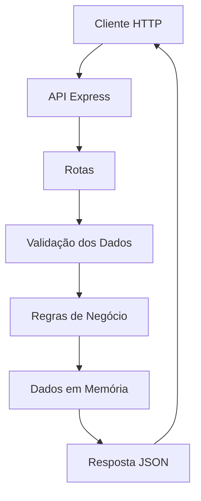

# Fluxo da API

```mermaid
flowchart TD
    A[Cliente HTTP] --> B[API Express]
    B --> C[Rotas]
    C --> D[Validação dos Dados]
    D --> E[Regras de Negócio]
    E --> F[Dados em Memória]
    F --> G[Resposta JSON]
    G --> A
```