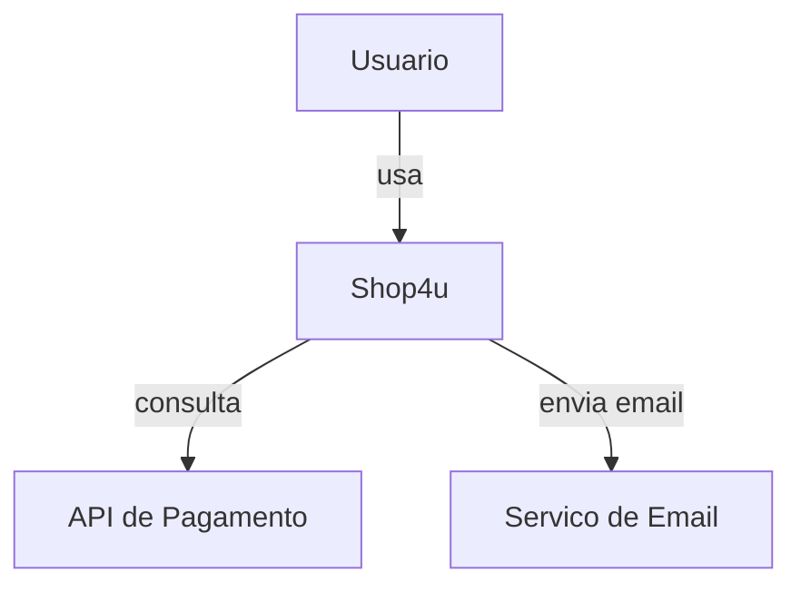
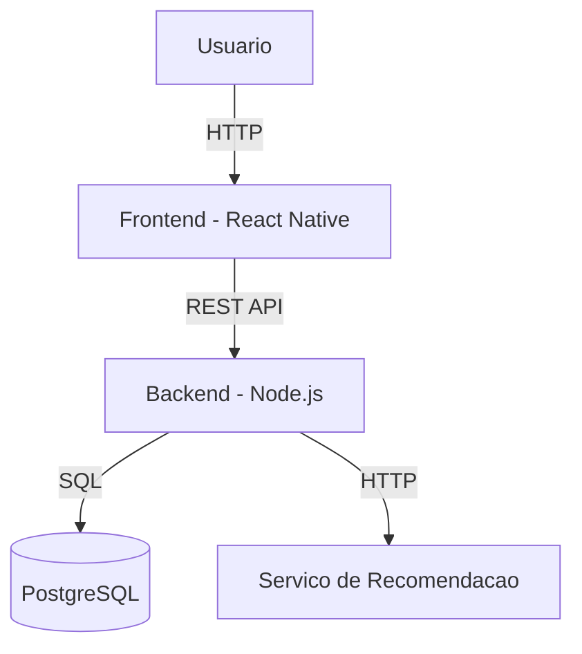

# Diagrama C4

## Finalidade

O modelo C4 documenta a arquitetura de software em quatro niveis de detalhe. Para o mini-projeto, os niveis 1 e 2 sao suficientes.

## Nivel 1 - Context

Mostra o sistema como uma caixa preta, seus usuarios e os sistemas externos com os quais se integra.

### Exemplo em Mermaid (Shop4u)

## Nivel 2 - Container

Mostra os principais componentes do sistema: frontend, backend, banco de dados.

### Exemplo em Mermaid (Shop4u)

## Como preencher para o seu projeto

Substitua os componentes pelos do seu projeto. Inclua apenas o que realmente existe na sua arquitetura.

## Justificativa

[Descreva aqui as decisoes arquiteturais: por que essa stack, quais alternativas foram consideradas e por que foram descartadas.]
