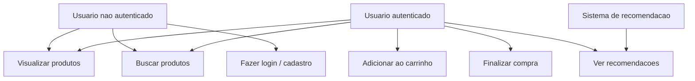

# Diagrama de Caso de Uso

## Finalidade

O diagrama de caso de uso mostra os atores do sistema e as funcionalidades que cada um pode acessar. E util para comunicar o escopo do produto de forma visual.

## Quando usar

- Para apresentar as funcionalidades do sistema para stakeholders nao tecnicos.
- Para identificar os perfis de usuario e o que cada um pode fazer.
- Como complemento ao PRD e as User Stories.

## Exemplo em Mermaid (Shop4u)

## Como preencher para o seu projeto

Substitua os atores e funcionalidades pelos do seu projeto. Mantenha o diagrama simples: foque nos casos de uso principais.

## Justificativa

[Descreva aqui as decisoes tomadas ao definir os atores e casos de uso do seu projeto.]
