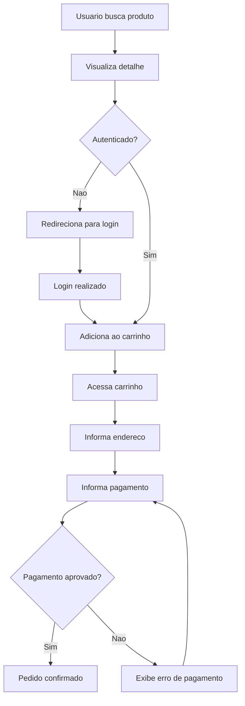
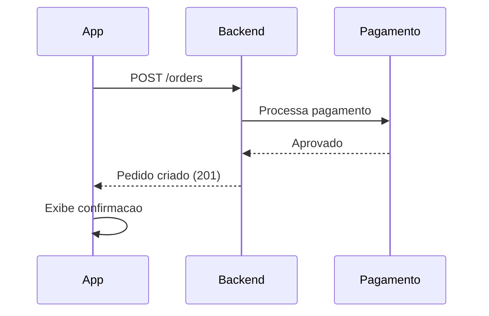

# Fluxo de Compra

## Finalidade

Documenta o fluxo completo de uma compra, do ponto de vista do usuario e do sistema.

## Fluxo do usuario (Shop4u)

## Fluxo do sistema

## Como adaptar para o seu projeto

Substitua os passos pelos do seu fluxo principal. Documente tambem os fluxos de erro (pagamento recusado, produto sem estoque, etc.).
