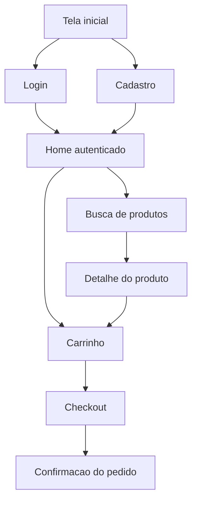

# Fluxo de Navegacao

## Finalidade

O fluxo de navegacao mostra como o usuario se move entre as telas do produto. E util para validar a experiencia do usuario antes de implementar.

## Quando usar

- Para planejar a estrutura de telas antes de desenvolver.
- Para identificar telas que faltam ou fluxos inconsistentes.
- Como complemento aos wireframes e mockups.

## Exemplo em Mermaid (Shop4u)

## Como preencher para o seu projeto

Mapeie as telas do seu produto e as transicoes entre elas. Inclua os pontos de entrada (tela inicial, login) e os fluxos principais.

## Observacao

Salve o diagrama exportado como imagem nesta pasta se quiser incluir na apresentacao.
